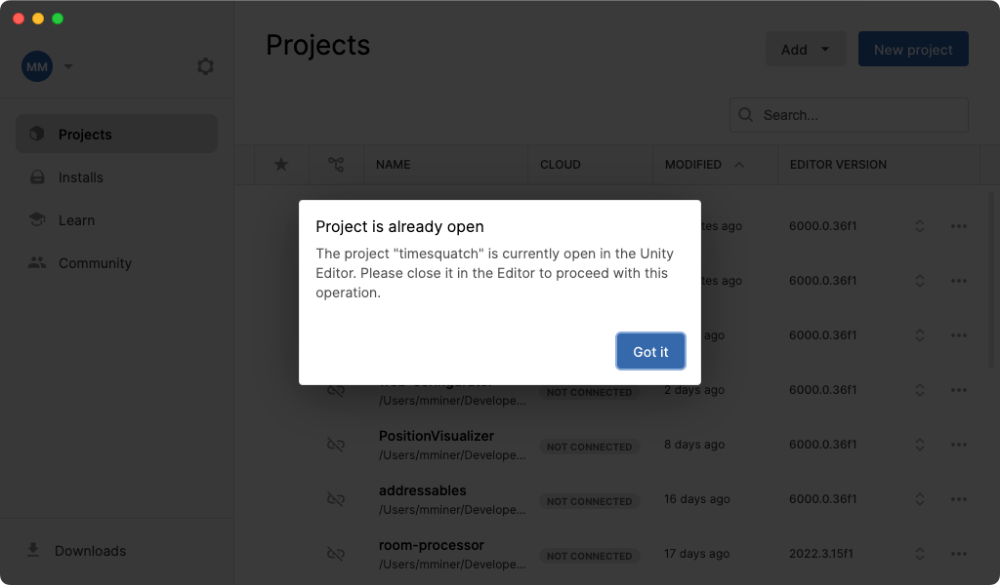

# Unity Menu

A macOS menubar app to quickly open running Unity projects.


For quick access, assign a global keyboard shortcut in the Settings window.


## Why?

If you have multiple Unity projects open at once, it can be a chore to find the
one you want. Neither the Dock nor the app switcher help much.


If you *don't* often juggle multiple Unity projects at once, Unity Menu will be
useless to you. And for that I'm sorry.


## Why Not Use Unity Hub?

Unity Hub works great for launching project, but try to launch one that's
already open and you get a "Project is already open" message.



This is... well, it could be more helpful.

Unity Menu works the opposite way: it only shows projects that are open, and
clicking one of them brings that instance of Unity to the front.


## Command Line Tool

The *Unity Menu.app* package contains a command line tool you can use to open
Unity projects from the terminal.

```
$ alias unity-menu="/Applications/Unity\ Menu.app/Contents/MacOS/unity-menu"
```

```
$ unity-menu --help
OVERVIEW: Open running Unity projects.

USAGE: unity-menu [<selection>]

ARGUMENTS:
  <selection>             Unity project selection.

OPTIONS:
  -h, --help              Show help information.
```

```
$ unity-menu
[1] Grand Theft Auto 6
[2] Huedini
[3] Orbert
[4] Time Squatch
Selection: 3
```


## Implementation

Unity Menu finds open Unity projects by reading the output of `ps`. If you think
this sounds fragile, you're right.
